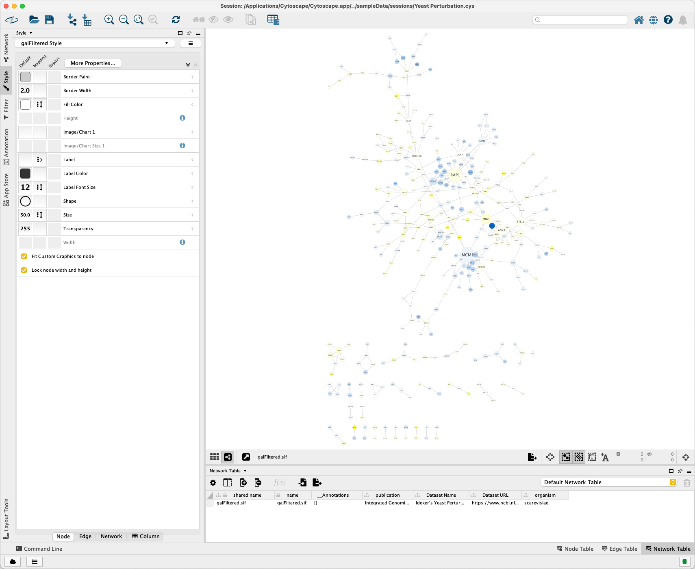
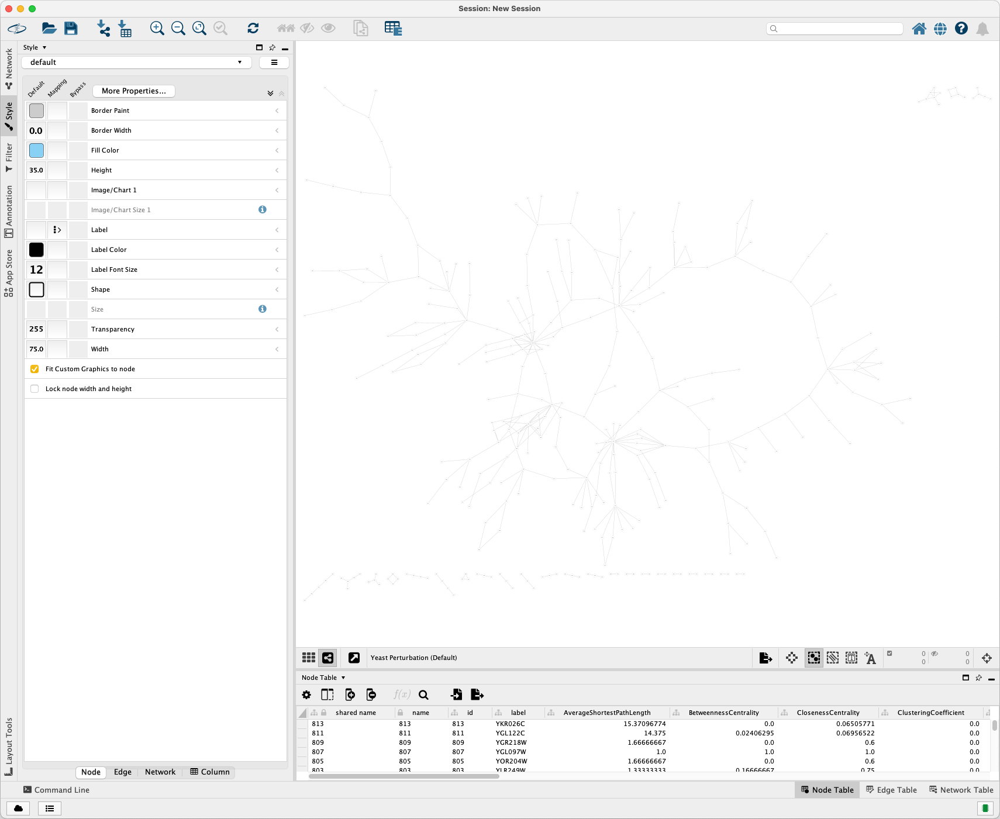

# 示例

## 示例数据

打开 Cytoscape，选择 Yeast Perturbation 示例数据。



单击 `File > Export > Network to File...` 将其导出为 XGMML 格式文件。


导出的 `yeast_perturbation.xgmml` 文件存储于仓库的[此目录](https://github.com/leovan/xgmml/tree/main/data/tests)。

## 读取器

以 `NetworkxXGMMLReader` 为例，运行如下代码读取 XGMML 文件：

```python
from xgmml.reader.networkx_xgmml_reader import NetworkxXGMMLReader

xgmml_reader = NetworkxXGMMLReader()
yeast_perturbation_graph = xgmml_reader.read('yeast_perturbation.xgmml')
```

运行如下代码查看图的基本信息：

```python
yeast_perturbation_graph.is_directed()
# True

len(yeast_perturbation_graph.nodes)
# 330

len(yeast_perturbation_graph.edges)
# 359
```

## 写入器

以 `NetworkxXGMMLWriter` 为例，将图写入 XGMML 文件：

```python
from xgmml.writer.networkx_xgmml_writer import NetworkxXGMMLWriter

xgmml_writer = NetworkxXGMMLWriter()
xgmml_writer.write(
    yeast_perturbation_graph,
    'yeast_perturbation.xgmml',
    graph_label='Yeast Perturbation (Default)',
)
```

导入 Cytoscape，可视化如下所示：



运行如下代码创建与原始 XGMML 文件类似的样式并写入 XGMML 文件：

```python
import matplotlib as mpl
from xgmml.writer.networkx_xgmml_writer import NetworkxXGMMLWriter
from xgmml.style.style_mapper import *

class StyleNodeSizeMapper(StyleNodeSizeDefaultContinuousMapper):
    def __init__(self, values, **kwargs):
        super(StyleNodeSizeMapper, self).__init__(values, **kwargs)

        self._min_size = 40
        self._max_size = 150


class StyleNodeLabelFontSizeMapper(StyleFontSizeDefaultContinuousMapper):
    def __init__(self, values, **kwargs):
        super(StyleNodeLabelFontSizeMapper, self).__init__(values, **kwargs)

        self._min_size = 10
        self._max_size = 40


class StyleNodeFillColorMapper(StyleColorContinuousMapper):
    def __init__(self, values, **kwargs):
        colors = ['#0066CC', '#FFFFFF', '#FFFF00']
        colormap = mpl.colors.LinearSegmentedColormap.from_list('custom', colors)

        super(StyleNodeFillColorMapper, self).__init__(
            values, colormap=colormap, **kwargs
        )

xgmml_writer = NetworkxXGMMLWriter()
xgmml_writer.write(
    yeast_perturbation_graph,
    'yeast_perturbation.xgmml',
    graph_label='Yeast Perturbation (Restore Style)',
    node_label_key='COMMON',
    node_width_key='degree.layout',
    node_width_mapper=StyleNodeSizeMapper,
    node_height_key='degree.layout',
    node_height_mapper=StyleNodeSizeMapper,
    node_label_font_size_key='Degree',
    node_label_font_size_mapper=StyleNodeLabelFontSizeMapper,
    node_fill_color_key='gal1RGexp',
    node_fill_color_mapper=StyleNodeFillColorMapper,
)
```

导入 Cytoscape，可视化如下所示：


单击 `Layout > Prefuse Force Directed Layout` 可以获得更好的布局。


