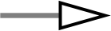

# 样式

## 枚举值

### 点形状

可选的点形状（`xgmml.utils.style_utils.NODE_SHAPES`）如下：

| 枚举值            |                             示例                            |
| ----------------- | :---------------------------------------------------------: |
| ELLIPSE           |        |
| RECTANGLE         |      |
| HEXAGON           |        |
| OCTAGON           |        |
| DIAMOND           |        |
| TRIANGLE          |       |
| ROUNDED_RECTANGLE |  |

### 线型

可选的线型（`xgmml.utils.style_utils.LINE_TYPES`）如下：

| 枚举值           |                             示例                            |
| ---------------- | :---------------------------------------------------------: |
| SOLID            |           |
| LONG_DASH        |       |
| DOT              |             |
| DASH_DOT         |        |
| EQUAL_DASH       |      |
| PARALLEL_LINES   |  |
| VERTICAL_SLASH   |  |
| FORWARD_SLASH    |   |
| BACKWARD_SLASH   |  |
| CONTIGUOUS_ARROW |  |
| SEPARATE_ARROW   |  |
| SINEWAVE         |        |
| ZIGZAG           |          |

### 箭头形状

可选的箭头形状（`xgmml.utils.style_utils.ARROW_SHAPES`）如下：

| 枚举值           |                             示例                            |
| ---------------- | :---------------------------------------------------------: |
| ARROW            |         |
| ARROW_SHORT      |   |
| CIRCLE           |        |
| CROSS_DELTA      |   |
| CROSS_OPEN_DELTA |  |
| DELTA            |         |
| DELTA_SHORT_1    |  |
| DELTA_SHORT_2    |  |
| DIAMOND          |       |
| DIAMOND_SHORT_1  |  |
| DIAMOND_SHORT_2  |  |
| HALF_BOTTOM      |   |
| HALF_CIRCLE      |   |
| HALF_TOP         |      |
| NONE             |                                                              |
| OPEN_CIRCLE      |   |
| OPEN_DELTA       |    |
| OPEN_DIAMOND     |  |
| OPEN_HALF_CIRCLE |  |
| OPEN_SQUARE      |   |
| SQUARE           |        |
| T                |             |

### 颜色

默认的离散颜色（`xgmml.utils.style_utils.COLORS`）如下：

| HEX     |                             示例                             |
| ------- | :----------------------------------------------------------: |
| #1783FF | <svg width="60" height="20" xmlns="http://www.w3.org/2000/svg"><rect width="60" height="20" fill="#1783FF"/></svg> |
| #00C9C9 | <svg width="60" height="20" xmlns="http://www.w3.org/2000/svg"><rect width="60" height="20" fill="#00C9C9"/></svg> |
| #F0884D | <svg width="60" height="20" xmlns="http://www.w3.org/2000/svg"><rect width="60" height="20" fill="#F0884D"/></svg> |
| #D580FF | <svg width="60" height="20" xmlns="http://www.w3.org/2000/svg"><rect width="60" height="20" fill="#D580FF"/></svg> |
| #7863FF | <svg width="60" height="20" xmlns="http://www.w3.org/2000/svg"><rect width="60" height="20" fill="#7863FF"/></svg> |
| #60C42D | <svg width="60" height="20" xmlns="http://www.w3.org/2000/svg"><rect width="60" height="20" fill="#60C42D"/></svg> |
| #BD8F24 | <svg width="60" height="20" xmlns="http://www.w3.org/2000/svg"><rect width="60" height="20" fill="#BD8F24"/></svg> |
| #FF80CA | <svg width="60" height="20" xmlns="http://www.w3.org/2000/svg"><rect width="60" height="20" fill="#FF80CA"/></svg> |
| #2491B3 | <svg width="60" height="20" xmlns="http://www.w3.org/2000/svg"><rect width="60" height="20" fill="#2491B3"/></svg> |
| #17C76F | <svg width="60" height="20" xmlns="http://www.w3.org/2000/svg"><rect width="60" height="20" fill="#17C76F"/></svg> |

默认的连续颜色为 matplotlib 中的 coolwarm，如下图所示：


## 映射器

### 基映射器

基映射器为所有映射器的基类：

```python
class StyleMapper(ABC):
    def __init__(self, values: list, **kwargs):
        self._values = values

    @abstractmethod
    def map(self, value):
        raise NotImplementedError()
```

映射器通过 `map` 方法对样式值进行映射。`XGMMLWriter` 对象 `write` 方法中的 `kwargs` 参见将传递至 `StyleMapper` 类的初始化方法中。

### 离散映射器

默认的离散样式映射器有：

- 点形状：`xgmml.style.style_mapper.StyleNodeShapeDefaultDiscreteMapper`
- 颜色：`xgmml.style.style_mapper.StyleColorDefaultDiscreteMapper`
- 线型：`xgmml.style.style_mapper.StyleLineTypeDefaultDiscreteMapper`
- 箭头形状：`xgmml.style.style_mapper.StyleArrowShapeDefaultDiscreteMapper`

自定义离散样式映射器需要从 `xgmml.style.style_mapper.StyleDiscreteMapper` 类继承：

```python
class StyleDiscreteMapper(StyleMapper):
    def __init__(self, values: list, styles: list, **kwargs):
        super(StyleDiscreteMapper, self).__init__(values)

        self._styles = styles
        self._categories = sorted(set(values), key=self._sort_key)

    def _sort_key(self, value):
        return value

    def map(self, value):
        category_idx = self._categories.index(value)
        style_idx = category_idx % len(self._styles)

        return self._styles[style_idx]
```

其中，`values` 为离散值列表，`styles` 为对应样式列表。

自定义颜色离散样式映射器需从 `xgmml.style.style_mapper.StyleColorDiscreteMapper` 类继承：

```python
class StyleColorDiscreteMapper(StyleMapper):
    def __init__(self, values: list, colormap: mpl.colors.ListedColormap, **kwargs):
        super(StyleColorDiscreteMapper, self).__init__(values)

        self._colors = colormap.colors
        self._categories = sorted(set(values), key=self._sort_key)

    def _sort_key(self, value):
        return value

    def map(self, value):
        category_idx = self._categories.index(value)
        color_idx = category_idx % len(self._colors)

        return mpl.colors.to_hex(self._colors[color_idx])
```

其中，`values` 为离散值列表，`colormap` 为 matplotlib 的 `mpl.colors.ListedColormap` 实例。

以上均可以重载 `_sort_key` 方法，该方法用于离散值的排序键。

### 连续映射器

默认的连续样式映射器有：

- 点大小：`xgmml.style.style_mapper.StyleNodeSizeDefaultContinuousMapper`
- 字号：`xgmml.style.style_mapper.StyleFontSizeDefaultContinuousMapper`

自定义连续样式映射器需要从 `xgmml.style.style_mapper.StyleContinuousMapper` 类继承：

```python
class StyleContinuousMapper(StyleMapper):
    def __init__(self, values: list, **kwargs):
        super(StyleContinuousMapper, self).__init__(values)

        self._min_value = min(self._values)
        self._max_value = max(self._values)

    def _transform_value(self, value) -> float:
        if self._max_value - self._min_value == 0:
            return 0.0

        return (value - self._min_value) / (self._max_value - self._min_value)

    def map(self, value):
        return self._transform_value(value)
```

其中，`values` 为连续值列表。可以重载 `_transform_value` 方法，该方法用于将原始值转换为映射后的值。

自定义颜色离散样式映射器需从 `xgmml.style.style_mapper.StyleColorContinuousMapper` 类继承：

```python
class StyleColorContinuousMapper(StyleMapper):
    def __init__(
            self, values: list, colormap: mpl.colors.LinearSegmentedColormap, **kwargs
    ):
        super(StyleColorContinuousMapper, self).__init__(values)

        self._colormap = colormap
        self._normalizer = mpl.colors.Normalize(vmin=min(values), vmax=max(values))

    def map(self, value):
        color = self._colormap(self._normalizer(value))

        return mpl.colors.to_hex(color).upper()
```

其中，`values` 为离散值列表，`colormap` 为 matplotlib 的 `mpl.colors.ListedColormap` 实例。

### 直通映射器

直通映射器是指不进行任何映射的映射器，直接返回原始值：

```python
class StylePassthroughMapper(StyleMapper):
    def __init__(self, values: list, **kwargs):
        super(StylePassthroughMapper, self).__init__(values)

    def map(self, value):
        return value
```
